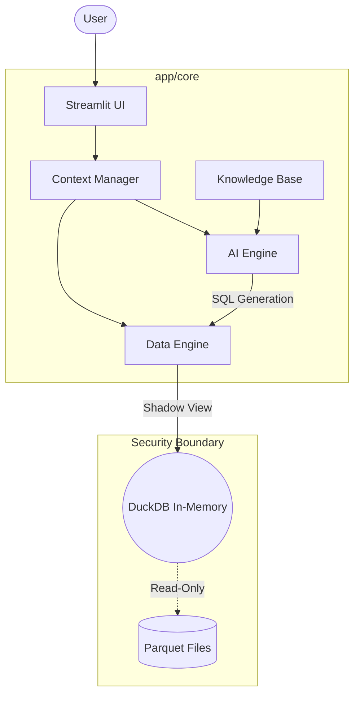

# Performance Analysis Assistant - App Layer

This repository contains the application layer built with Streamlit, FastAPI, and DuckDB, following a **Headless BI** architecture.

## 🏗 System Architecture



## 🧩 Core Modules

| Module | Responsibility | Status |
| :--- | :--- | :--- |
| **`context.py`** | User Identity & Permission Mapping | **Pending Verification** |
| **`engine.py`** | DuckDB Management & SQL Guardrails | **Skeleton Ready** |
| **`ai.py`** | NL2SQL Logic & LLM Integration | **Skeleton Ready** |
| **`knowledge_base.py`** | Business Logic & Domain Context | **Pending Verification** |

## 🚧 Pending Alignments

The following components require formal verification from relevant stakeholders:

1.  **Business Logic Alignment**: Definition of domain-specific metrics and rules.
2.  **Authentication Integration**: Token decoding and authorization scopes.
3.  **Data Schema Validation**: Mapping between raw parquet files and query engine.

## 🔒 Security & Governance

1.  **Data Isolation**: Users access data through a filtered **Shadow View** (Row-Level Security).
2.  **Query Protection**: SQL validation via `sqlglot` to prevent write operations and injection.
3.  **Resource Control**: Per-request in-memory connections with strict memory limits.

## 🚀 Execution

```bash
# Setup
uv sync

# Test
uv run pytest app/tests/

# Start
uv run streamlit run app/main.py
```